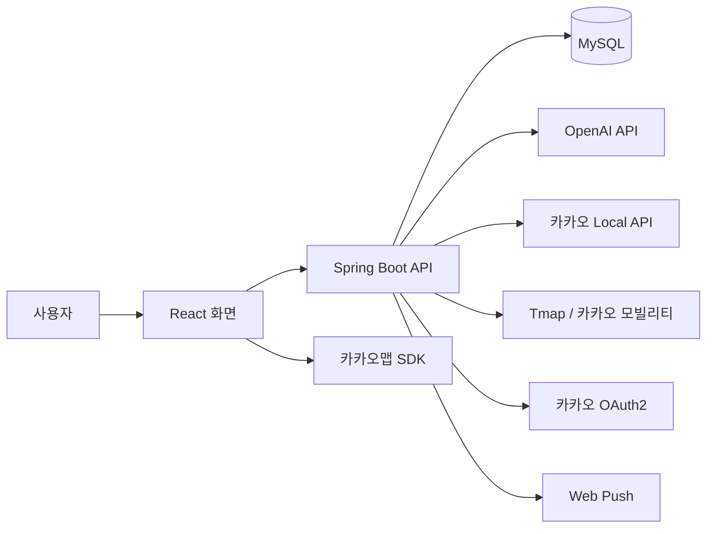
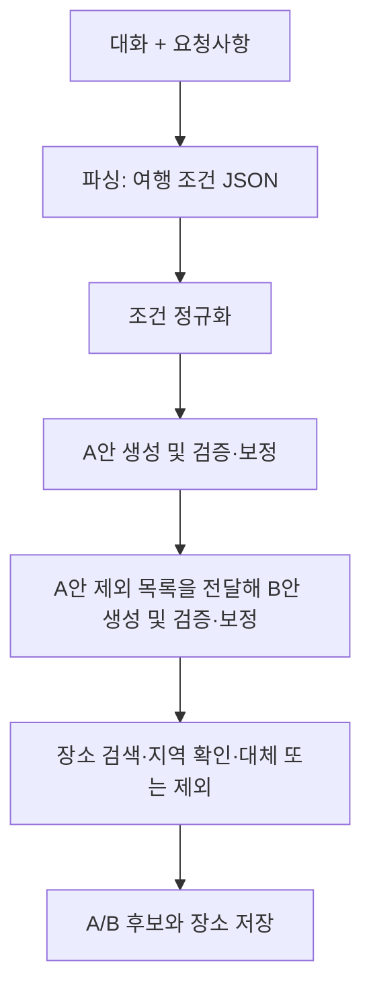

# triplan

### 단톡방의 여행 이야기를, 친구들이 함께 고르는 일정으로

카카오톡 단체 대화와 여행 요청사항으로 서로 다른 **A/B 여행 일정**을 만들고, 친구들의 **장소별 투표와 순서 선호**를 반영해 최종 일정을 구성하는 협업형 여행 플래너입니다.

**2인 캡스톤 프로젝트 · Java 17 / Spring Boot · React · OpenAI API**

[개인 기여와 기술적 의사결정](docs/contribution.md) · [백엔드 저장소](https://github.com/sku2026-triplan-dev/triplan-backend) · [프론트엔드 저장소](https://github.com/sku2026-triplan-dev/triplan-frontend)

> 학교 지원 KT Cloud에 배포하고 프로젝트 시연을 완료했습니다. 지원 종료로 현재 상시 체험 서버는 제공하지 않습니다. 배포·시연 및 PC·Android·iOS Web Push 수신은 개발 당시 직접 수행한 경험이며, 현재 환경에서 재실행한 결과와는 구분합니다.

---

## 왜 만들었나요?

여행 이야기는 단톡방에 쌓이지만, 날짜·예산·식단 제약과 서로 다른 취향을 일정으로 정리하는 일은 누군가 한 명이 맡게 됩니다. 한 사람이 입력한 조건으로 일정을 추천하는 기능에서 더 나아가, **여러 사람의 의견이 입력부터 최종 선택까지 이어지는 과정**을 만들고 싶었습니다.

triplan은 대화에서 조건을 정리하고 선택지를 제안하는 일을 AI에 맡깁니다. 친구들은 일정 전체에 한 표를 주는 대신 장소별로 선호를 표현하고, 호스트가 최종 일정 생성을 요청합니다.

캡스톤에서는 **목적지와 날짜가 어느 정도 정해진 짧은 대화에서 취향 차이를 추출하고, 생성부터 투표·최종 일정까지 연결하는 흐름**을 우선 구현했습니다. 임의의 긴 단톡방 전체를 안정적으로 분석하는 범용 서비스까지 완성한 것은 아닙니다.

## 사용 흐름

| 단계 | 사용자가 하는 일 | 구현한 기능 |
|---|---|---|
| 1. 입력 | 대화 TXT 또는 텍스트와 요청사항 입력 | 플랜 저장, 비동기 생성 요청 |
| 2. 비교 | A/B 일정과 지도 확인 | 조건 파싱, 후보 생성·검증, 장소·경로 표시 |
| 3. 공유·투표 | 링크로 참여해 장소 선호와 방문 순서 선택 | 공유 시 투표 상태 전환, 로그인 전 선택 보존, 로그인 후 일괄 제출 |
| 4. 결과 확인 | 장소별 반응·참여자·의견 확인 | 대시보드 집계, 호스트의 최종 일정 생성 요청 |
| 5. 최종 일정 | 투표 기반 추천 일정 확인 | 기존 A/B 장소 재구성, 별도 조회 API, 공유·브라우저 알림 |

**로그인 시점도 서비스 흐름의 일부로 설계했습니다.** 호스트는 생성 결과를 확인한 뒤 공유할 때, 게스트는 일정을 보고 선호를 고른 뒤 제출할 때 로그인하도록 유도합니다. 먼저 서비스의 가치를 경험하게 하려는 선택입니다.

PC에서는 넓은 화면으로 A/B와 지도를 비교하고, 모바일에서는 탭으로 선택한 일정과 지도에 집중하도록 표시 구성을 나눴습니다.

## 시스템 구조

| 영역 | 기술과 역할 |
|---|---|
| Backend | Java 17, Spring Boot 3.5.13, Spring Data JPA, Spring Security, OAuth2, JWT |
| Frontend | React 19, Vite, Tailwind CSS 3, React Router 7, Axios, dnd-kit |
| AI | OpenAI API, 파싱·A/B·최종 일정별 프롬프트, JSON 응답 처리 |
| 장소·지도 | 카카오 Local API로 장소 확인, 카카오맵 SDK로 지도 표시 |
| 경로 | 가까운 구간은 Tmap 보행자, 먼 구간은 카카오 모빌리티 자동차 경로 |
| 저장·배포 | MySQL 8, Docker Compose, KT Cloud VM, Nginx, systemd |
| 알림 | Web Push, Spring Scheduler 기반 D-1 리마인더 |

기술 표는 현재 로컬 `V3.2`의 의존성과 구현 기준입니다. 개발 중 시험한 AI 모델과 실제 실행 시 선택하는 모델은 구분합니다.

## 구현에서 집중한 세 가지

### 1. AI 결과를 일정으로 사용하기 위한 검증

파싱과 일정 생성의 역할을 나누고, A안의 장소 목록을 B안에 전달합니다. 숙소·이동을 제외한 장소의 중복을 줄이려는 구조입니다. 일정 규칙을 검사해 코드로 보정하거나 제한된 재시도를 수행하고, 사용할 수 없는 결과에는 대체 일정 생성 경로를 적용했습니다.

장소명만 그럴듯한 결과를 지도에 표시하지 않도록 카카오 검색 결과의 좌표·카테고리·지역을 확인합니다. 비용은 **교통·숙박 등 예약 비용을 제외한 1인당 현장 예상 지출**로 범위를 정하고 장소별 비용을 다시 합산합니다. 실시간 가격 견적은 아닙니다.

### 2. 로그인 이동 중 선택 보존과 재투표 처리

로그인 전 선택을 브라우저 `localStorage`에 보관하고 제출 대기 상태를 남깁니다. 로그인 복귀 후 점수와 순서 선호를 일괄 제출하며, 성공한 임시 데이터만 정리합니다.

서버는 플랜의 투표 가능 상태와 후보·장소 소속을 확인합니다. 동일 사용자·장소의 재투표는 기존 값을 갱신하고, DB 스키마에는 해당 조합의 유니크 키를 둡니다. 브라우저 임시 선택 보존과 DB에 저장된 게스트 데이터의 회원 병합은 서로 다른 기능입니다.

### 3. 장소별 선호를 반영하는 최종 일정

호스트가 요청하면 최종 AI는 기존 A/B 장소 ID를 선택해 일정을 재구성합니다. 백엔드는 해당 장소의 이름·좌표·비용을 재사용하고, AI 결과를 사용할 수 없으면 규칙 기반 대체 경로를 사용합니다.

생성 명령인 `POST /finalize`와 읽기 요청인 `GET /final`을 분리했습니다. 최종 일정 생성은 준비 조회 → 트랜잭션 밖 AI 호출 → 저장 트랜잭션으로 처리하며, 저장 시 플랜 잠금과 상태 재검사를 수행합니다.

→ [문제 상황, 실제 코드, 선택 이유와 한계 자세히 보기](docs/contribution.md)

## 코드 탐색

아래 링크는 원본 저장소의 `V3.2` 기준이며, 저장소 접근 권한이 필요할 수 있습니다.

| 사용자 기능 | 프론트 진입점 | 백엔드 핵심 |
|---|---|---|
| 입력·생성 | [PlanNewPage.jsx](https://github.com/sku2026-triplan-dev/triplan-frontend/blob/V3.2/src/pages/PlanNewPage.jsx) | [PlanService.java](https://github.com/sku2026-triplan-dev/triplan-backend/blob/V3.2/triplan/src/main/java/com/triplan/triplan/service/PlanService.java): `createPlan`, `generateWithAI` |
| AI 처리 | [S2ResultPage.jsx](https://github.com/sku2026-triplan-dev/triplan-frontend/blob/V3.2/src/pages/S2ResultPage.jsx) | [AiGenerationService.java](https://github.com/sku2026-triplan-dev/triplan-backend/blob/V3.2/triplan/src/main/java/com/triplan/triplan/service/AiGenerationService.java): `generateAsync` |
| 투표 | [S3VotePage.jsx](https://github.com/sku2026-triplan-dev/triplan-frontend/blob/V3.2/src/pages/S3VotePage.jsx) | [VoteService.java](https://github.com/sku2026-triplan-dev/triplan-backend/blob/V3.2/triplan/src/main/java/com/triplan/triplan/service/VoteService.java): `saveBatch` |
| 통계·최종 생성 | [S4DashboardPage.jsx](https://github.com/sku2026-triplan-dev/triplan-frontend/blob/V3.2/src/pages/S4DashboardPage.jsx) | `DashboardService.getDashboard`, `PlanService.finalizePlan` |
| 최종 조회 | [S5ConfirmedPage.jsx](https://github.com/sku2026-triplan-dev/triplan-frontend/blob/V3.2/src/pages/S5ConfirmedPage.jsx) | `PlanService.getFinalCandidate` |

DB의 중심 관계는 `PLANS → PLAN_CANDIDATES → PLACES`입니다. A/B와 최종 D안은 같은 후보 테이블에 저장하며, `is_final`로 최종안을 구분합니다. 참여자·장소 투표·전체 의견은 각각 `PLAN_PARTICIPANTS`, `VOTES_FEEDBACKS`, `PLAN_COMMENTS`로 관리합니다.

## 검증과 현재 범위

| 구분 | 확인한 범위 |
|---|---|
| 구현 | AI 검증·보정·fallback, 비동기 실패 복구, 투표 저장, 최종 생성·조회, 지도·경로, Web Push |
| 개발 당시 직접 경험 | KT Cloud 배포·시연 완료, PC·Android·iOS에서 브라우저 알림 수신 확인 |
| 과거 자동 검사 기록 | 2026-09-11 점검 문서에 백엔드 116개 테스트 통과·프론트 빌드 성공 기록. 프론트 lint는 오류 5건 기록 |
| 별도 검증이 필요한 범위 | 실제 긴 대화의 생성 성공률, 두 기기 동시 투표, 중복 최종 생성 요청의 AI 비용, 현재 서버 운영 상태 |

테스트 개수는 전체 백엔드 검사 기록이며, 실제 여행 생성 성공 건수나 AI 정확도를 뜻하지 않습니다. 로그인 전환율·합의 시간 단축·모델별 성능 개선률은 측정하지 않았습니다.

<strong>한계와 다음 개선 방향</strong>

- 긴 실제 대화: 잡담과 변경된 의견 속에서 필수 제약을 보존하는 처리와 평가가 필요합니다.
- 장소 다양성: 검증은 실제 장소와 지역을 확인하지만 최신 메뉴·리뷰 기반 최적 추천을 보장하지 않습니다. 대체 후보 카탈로그에도 지역 범위가 있습니다.
- 비동기 생성: 실패 시 `DRAFT`로 복구해 다시 시작합니다. 단계별 결과를 저장해 중간부터 재개하는 기능은 없습니다.
- 대기 안내: 현재 로딩 문구는 시간에 따라 바뀌며 실제 AI 단계와 연동되지 않습니다.
- 최종 생성: 저장 시 중복 결과를 방어하지만, 동시 요청의 중복 AI 호출 가능성은 남습니다.
- 운영 보호: 비로그인 생성의 비용 제한과 소유권 확보 절차는 보완 대상입니다.
- 후기·취향 학습: 데이터 모델은 있으나 후기 기반 개인화 흐름은 미구현입니다.

---

**문석용 · 서비스 기획과 주요 개발·통합, 프롬프트 및 발표·보고서 작성 주도**  
2인 팀 프로젝트의 전체 소개와 개인 기여는 [별도 문서](docs/contribution.md)로 구분했습니다.
