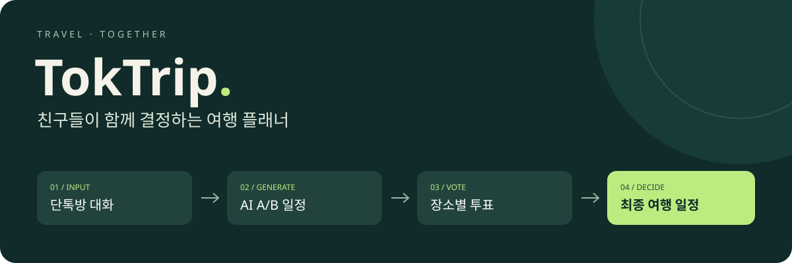

# TokTrip

**단톡방의 여행 이야기를, 친구들이 함께 고르는 일정으로.**

카카오톡 대화와 요청사항으로 서로 다른 A/B 여행 일정을 만들고, 장소별 투표와 방문 순서 선호를 반영해 최종 D안을 구성하는 협업형 여행 플래너입니다.

**2인 캡스톤 · Java 17 / Spring Boot · React · OpenAI API**

[개인 기여와 의사결정](docs/contribution.md) · [공개 코드 근거](docs/code-evidence.md) · [시스템 구조와 구현 범위](docs/architecture.md)

> 최종 서비스명은 **TokTrip**입니다. 개발 당시 이름인 `triplan`은 패키지·클래스 경로에 남아 있습니다. 이 저장소에는 서비스 문서와 비밀 설정을 제거한 공개용 소스 스냅샷이 함께 있습니다.

## 어떤 문제를 풀었나요?

단톡방에는 날짜·예산·식단 제약과 취향이 함께 쌓입니다. 이를 한 사람이 다시 정리하는 부담을 줄이고, **같이 여행할 사람들이 최종 결정에도 참여하도록** 만들었습니다.

| ① 대화 입력 | ② 후보 비교 | ③ 함께 선택 | ④ 최종 일정 |
| :--- | :--- | :--- | :--- |
| 대화 TXT·텍스트와 요청사항 | AI A/B 일정·지도 확인 | 장소별 투표·방문 순서·의견 | 호스트 요청으로 D안 재구성 |

호스트는 생성 결과를 확인한 뒤 공유할 때, 참여자는 일정을 보고 선택한 뒤 제출할 때 로그인하도록 흐름을 구성했습니다.

## 제가 집중한 세 가지

서비스 기획과 주요 개발·통합, AI 프롬프트와 발표·보고서 작성을 주도했습니다.

| 겪은 문제 | 구현과 선택 | 자세히 보기 |
| :--- | :--- | :--- |
| A/B가 비슷하거나 일정 조건·장소가 맞지 않음 | 파싱·후보 생성 분리, B안에 A안 제외 목록 전달, 검증·보정·대체 처리 | [경험](docs/contribution.md#case-ai) · [코드](docs/code-evidence.md#ai) |
| 로그인 이동 중 선택을 잃거나 재투표가 중복 집계될 수 있음 | 브라우저 임시 선택 보존, 로그인 복귀 후 제출, 동일 사용자·장소 투표 갱신 | [경험](docs/contribution.md#case-vote) · [코드](docs/code-evidence.md#vote) |
| 장소별 투표를 받아도 A/B 중 한 안을 통째로 선택 | 기존 장소 ID로 최종 일정 재구성, 생성·조회 분리, 저장 시 잠금·상태 재검사 | [경험](docs/contribution.md#case-final) · [코드](docs/code-evidence.md#final) |

## 기술 구성

| Backend | Frontend | 외부 연동·배포 |
| :--- | :--- | :--- |
| Java 17 · Spring Boot 3.5 · JPA · Security · MySQL | React 19 · Tailwind CSS · Axios · dnd-kit | OpenAI · Kakao · Tmap · Web Push · Docker Compose · Nginx · KT Cloud |

[화면 → API → 서비스 → 저장소 연결과 상세 구조 보기](docs/architecture.md)

## 소스 코드

| 경로 | 내용 |
| :--- | :--- |
| [`backend/`](backend/) | Spring Boot API, AI 생성·검증, 투표, 최종 일정, 알림 구현과 테스트 |
| [`frontend/`](frontend/) | React S1~S5 화면, 인증 복귀, 투표·대시보드·확정 일정 흐름 |
| [`docs/code-evidence.md`](docs/code-evidence.md) | 핵심 코드의 역할과 설계 판단을 함께 읽는 안내서 |

실제 비밀번호와 외부 API 키, 빌드 결과물, IDE 설정, 로그와 기존 비공개 Git 이력은 포함하지 않습니다. 로컬 실행 시 [`backend/src/main/resources/application.properties.example`](backend/src/main/resources/application.properties.example)과 [`frontend/.env.example`](frontend/.env.example)을 참고해 환경 변수를 설정합니다.

## 결과와 현재 상태

- **개발 당시:** KT Cloud 배포·시연 완료, PC·Android·iOS에서 Web Push 수신 직접 확인.
- **현재:** 학교 클라우드 지원이 종료되어 상시 체험 서버는 제공하지 않습니다.
- **검증 기록:** 공개 스냅샷에서 백엔드 테스트 116개를 다시 실행해 모두 통과했습니다. 프론트는 같은 소스로 2026-09-11 빌드 성공 기록을 확인했으며, 공개본 패키지 재설치는 현재 네트워크 제한으로 완료하지 못했습니다.
- **남은 과제:** 긴 실제 대화의 조건 보존, 동시 최종 생성 요청의 중복 AI 비용, 프론트 lint 오류. AI 정확도·사용자 만족도 개선률은 측정하지 않았습니다.

---

### 더 살펴보기

- [개인 기여](docs/contribution.md): 문제 → 선택 → 구현 → 한계
- [공개 코드 근거](docs/code-evidence.md): 비공개 원본 접근 없이 읽을 수 있는 실제 구현
- [구조·검증 범위](docs/architecture.md): 전체 흐름과 남은 개선점

**문석용 · [GitHub](https://github.com/Moonse01)**
