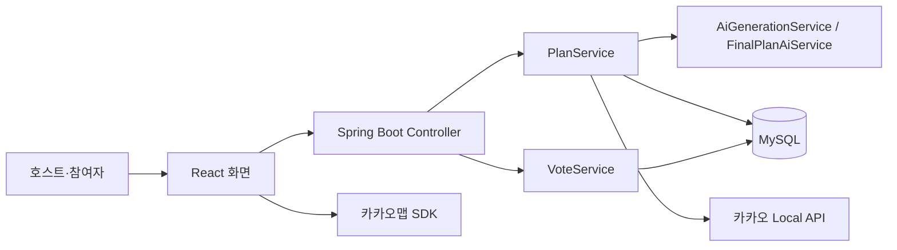
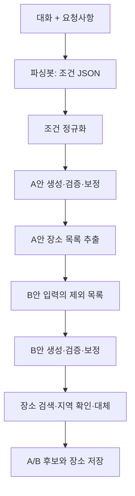

# TokTrip 시스템 구조와 구현 범위

[프로젝트 소개](../README.md) · [개인 기여](contribution.md) · [공개 코드 근거](code-evidence.md)

## 화면에서 저장까지



| 사용자 흐름 | 프론트 시작점 | 백엔드 책임 | 저장·외부 연동 |
| :--- | :--- | :--- | :--- |
| 대화·요청 입력, A/B 생성 | `PlanNewPage.jsx` | `PlanService.createPlan` → `AiGenerationService.generateAsync` | `PLANS`, OpenAI, 카카오 장소 검색 |
| A/B 확인·공유 | `S2ResultPage.jsx` | `PlanService.getPlan`, 후보 조회 | `PLAN_CANDIDATES`, `PLACES`, 카카오맵 |
| 장소별 투표·순서 선호 | `S3VotePage.jsx` | `VoteService.saveBatch` | `VOTES_FEEDBACKS`, `PLAN_PARTICIPANTS` |
| 통계 확인·D안 생성 | `S4DashboardPage.jsx` | `DashboardService.getDashboard`, `PlanService.finalizePlan` | 기존 후보·투표 조회, OpenAI |
| 최종 일정 조회 | `S5ConfirmedPage.jsx` | `PlanService.getFinalCandidate` | `PLAN_CANDIDATES.is_final` |

## AI 생성 흐름



- 파서 호출은 API 예외일 때 최대 3회 시도합니다.
- A/B 플래너는 각 최대 2회 생성·검증하고, 코드로 보정 가능한 데이터는 보정 후 재검사합니다.
- A안의 장소 목록을 B안 생성에 전달합니다. 중복이 완전히 사라진다는 수치 검증은 없습니다.
- 존재하지 않거나 지역에 맞지 않는 장소는 검증·대체·제외 경로를 거칩니다.

## D안 생성과 동시성 범위

```text
POST /plans/{uuid}/finalize
  준비 트랜잭션: 호스트·상태 검사, 후보·투표 조회
  트랜잭션 밖: AI에 기존 장소 ID를 선택하게 요청
  저장 트랜잭션: 플랜 잠금, 상태 재검사, D안과 장소 저장

GET /plans/{uuid}/final
  저장된 D안 조회
```

최종안은 A/B 후보 중 하나를 통째로 선택하지 않고, AI가 기존 장소의 `source_place_id`를 선택해 재구성합니다. 저장 시 잠금과 상태 재검사를 수행하지만, 두 요청이 저장 전에 AI를 각각 호출하는 중복 비용 가능성은 남아 있습니다.

## 확인한 범위와 남은 과제

| 구분 | 내용 |
| :--- | :--- |
| 구현 확인 | AI 검증·보정·대체, 투표 저장·재투표 갱신, D안 재구성·조회, 지도·경로·Web Push |
| 개발 당시 직접 확인 | KT Cloud 배포·시연, PC·Android·iOS의 브라우저 알림 수신 |
| 과거 검사 기록 | 2026-09-11 문서에 백엔드 116개 테스트 통과·프론트 빌드 성공 기록 |
| 현재 별도 검증 필요 | 긴 실제 대화 성공률, 동시 투표, 동시 최종 생성 요청, 서버 운영 상태 |

AI 정확도·사용자 만족도·로그인 전환율·합의 시간 단축 수치는 측정하지 않았습니다.
